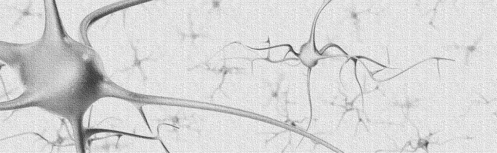

## Hey :)

>[LABS](https://github.com/vxnuaj/LABS),  [WEBSITE](https://vxnuaj.life), [NEWSLETTER](https://vxnuaj.substack.com), [MEDIUM](https://medium.com/@vxnuaj)  
> **Last Update**: 04/15/2024

I'm Juan.

I like to tinker with technology.

Someday, I'll be able to build deep learning models, neurmorphic chips, and robots just for myself.  

That's my concept (at least a portion) of my ideal future rn.

I also have this vision of pushing humanity forward by building scalable projects at the intersection of the bleeding edge of technology and my curiosity.

I think if I learn how to build within my curiosities, I'll be able to generate [specific knoweldge](https://nav.al/specific-knowledge) to ultimately produce [great work](https://paulgraham.com/greatwork.html) for humanity.

THE BLUEPRINT (TLDR)

1. **Learn how to build. Build exceptional engineering skillsets with deep technologies.**

    **Programming**: Python, C/C++.

    **Deep Learning:** Neural Nets, RNNs, CNNs, Transformers $\rightarrow$ TBD

    > _TBD, as in I'm not sure what might be possible with the knowledge I'll get nor where my curiosity will lie_

    **AFTER**: I'm not sure where I'll go after. My thoughts and intentions right now are to either go towards neurmorphic chips (post moore's law), get deep into building humanoids, or build seamless interaction with brain-computer-interfaces

    >_My rationale behind going with deep learning is the role I believe t'll play in shaping our future. It's ienvitable that AGI / ASI will disrupt our future._

2. **Build & learn alongside exceptional founders and engineers.**

    **SF**: I'm spending my gap year (2024-2025) in silicon valley for this very reason.

    **Deep Tech**: Directly contribute and build at a deep tech company by summer 2025. (i.e., OpenAI, DeepMind, Mistral, FigureAI, ExtropicAI, Nvidia, etc)

These github repos serve as a training grounds for myself, as I build the engineering skillsets I want.
 

>_If you're navigating my github, you'll see most activity in my [Labs](https://github.com/vxnuaj/LABS), but will see more tangible projects as seperate repositories [here](https://github.com/vxnuaj?tab=repositories)_

If you wanna chat, feel free to message me on [twitter](x.com/vxnuaj) or [email](mailto:jv.100420@gmail.com)