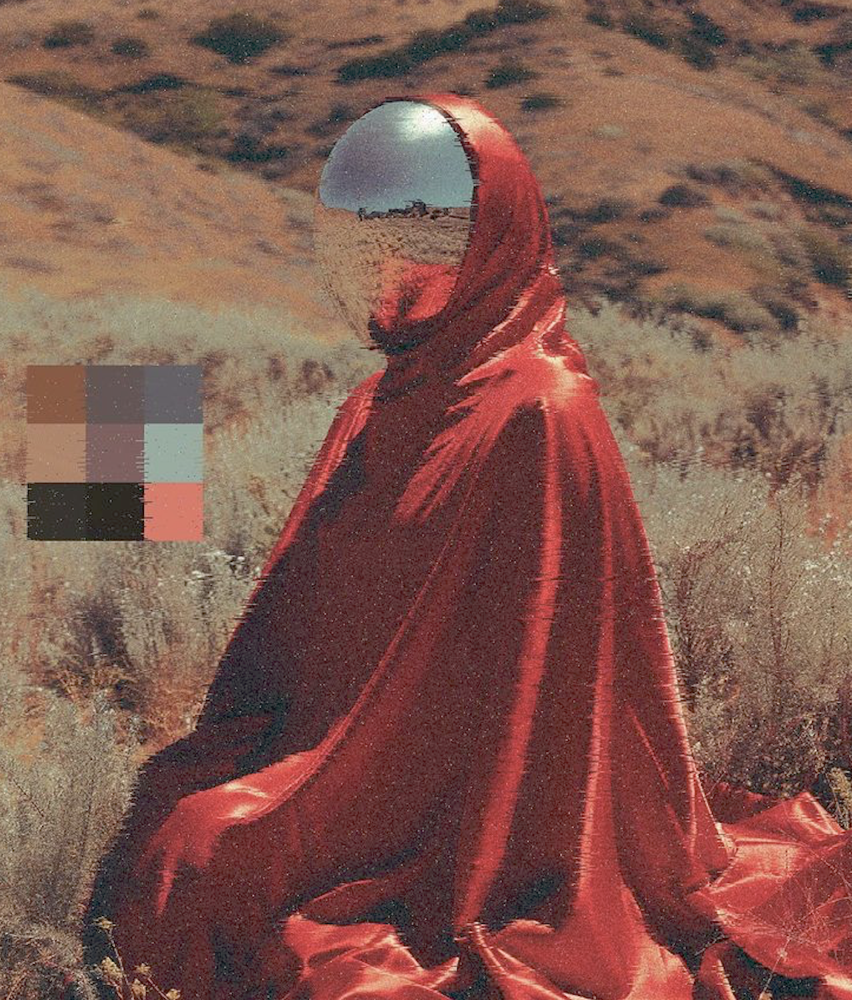

 
  

    <samp>
      19 y/o.
       
       
      I'm based in San Francisco (currently travelling).
       
      I'm on a gap year, deferred from UC Davis.
       
       
      I'm self-learning / have self-learnt linear algera, multivariable calculus, probability theory, and the theory of convolutional neural networks.
        
        
     Currently, I'm working on deep learning and understanding natural language processing on a deeper level.
        
        
      I also run a lot (when I'm not injured), but I'm not training for anything -- maybe I will soon. If you wanna go on a long run sometime (15+ mi.), let me know.
        
        
      I'll occasionally update this, but don't expect too much!
      </samp>
  

