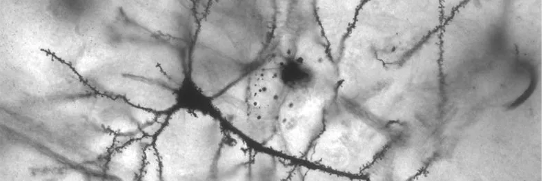

## Hey :)

>[LABS](https://github.com/vxnuaj/LABS), [NEOCORTEX](https://github.com/vxnuaj/NEOCORTEX), [WEBSITE](https://vxnuaj.life), [NEWSLETTER](https://vxnuaj.substack.com), [MEDIUM](https://medium.com/@vxnuaj)  
> **Last Update**: 06/06/2024

I opted out of UC Davis to fly across the country to Silicon Valley to learn
from exceptional founders and engineers.

Currently, I’m maximizing my skillsets within Deep Learning with the goal
to get to it’s bleeding edge within the year.

> _These github repos serve as a training grounds for myself, as I learn to build._

Recently, I’ve been obsessed with neural networks, knowledge creation &
epistemology, and paths to artificial superintelligence.

> _I'm shipping deep dives on these topics @ [my newsletter, infinity](https://vxnuaj.substack.com/s/infinity)!_

Also, I [run](https://strava.com/vxnuaj) (If you’re reading this, lemme know if you wanna go on a 15 mi. run. No one, besides 1, has been down for it so far!)

If you wanna chat, message me on [X](https://x.com/vxnuaj) or [schedule a call](https://cal.com/vxnuaj)!

Alternatively, if you want to stay updated with what I’ve been working on,
check out my GitHub or subscribe to my Substack.

>_If you're navigating my github, you'll see most activity in my [LABS](https://github.com/vxnuaj/LABS) or [NEOCORTEX](https://github.com/vxnuaj/NEOCORTEX), but will see more tangible projects as seperate repositories [here](https://github.com/vxnuaj?tab=repositories)_
